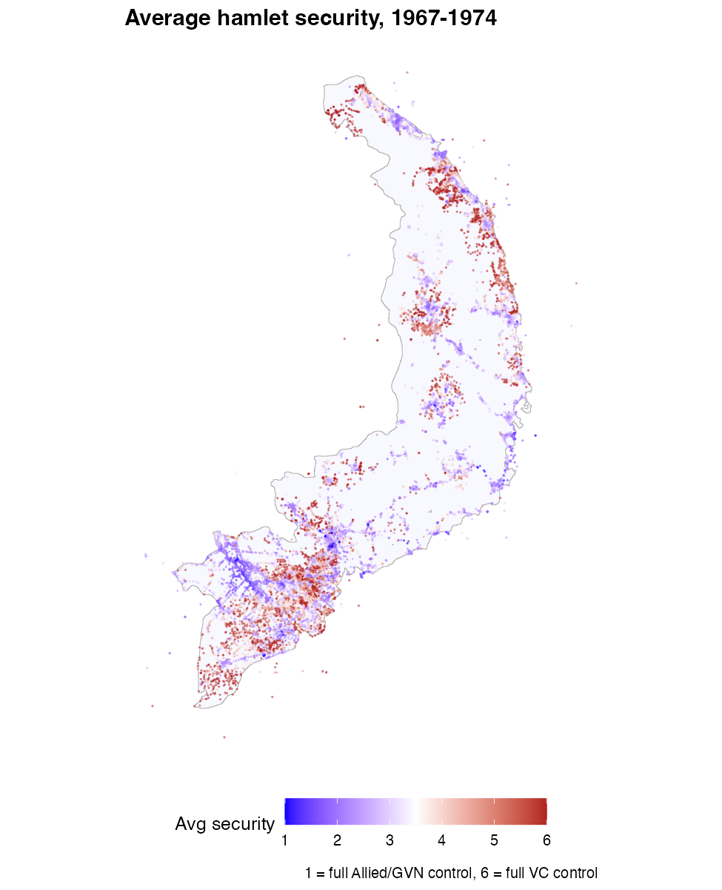
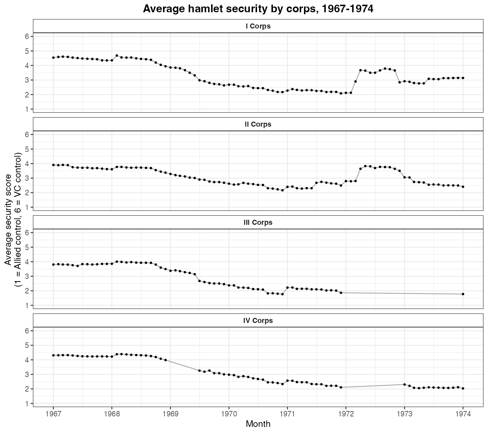

# Combining and Mapping Hamlet Security (HES)

The Hamlet Evaluation System comes in two package files:
[`get_hes_hamla()`](https://gl-smith.github.io/VietnamWarData/reference/get_hes_hamla.md)
(HAMLA, 1967–1969) and
[`get_hes70()`](https://gl-smith.github.io/VietnamWarData/reference/get_hes70.md)
(HES-70/71, 1969–1974). They use different column layouts, but both
classify every hamlet into the same security category — Score A through
Score E, plus VC Controlled. This article uses that common category to
combine the two files into a single 1–6 security score and then maps it.

Code chunks are not run when the site is built (the HES files are large
downloads); the figures shown are pre-rendered.

## Setup

``` r

library(VietnamWarData)
library(dplyr)
library(stringr)
library(lubridate)
library(sf)
library(ggplot2)

# South Vietnam outline, dissolved from the province boundaries
sv_outline <- get_province_boundaries() |> st_union()
```

## Combine HAMLA and HES-70/71 on the hamlet category

Keep the hamlet-level records from each file, line up the shared columns
(renaming coordinates and the category field), join, then translate the
category into an ordered score: A = 1 (full Allied/GVN control) … E = 5,
V = 6 (full VC control).

``` r

hamla <- get_hes_hamla() |>
  filter(record_type == "Hamlet Record") |>
  transmute(us_hamlet_id, corps_region_code, date = as.Date(date),
            lat, lng, hamlet_category = classification_level_indicator_of_hamlet)

hes70 <- get_hes70() |>
  filter(rectp_record_type == "Hamlet Record") |>
  transmute(us_hamlet_id, corps_region_code, date = as.Date(date),
            lat = hamlet_lat, lng = hamlet_lng, hamlet_category = hcat_hamlet_category)

hes <- full_join(
    hamla, hes70,
    by = c("us_hamlet_id", "corps_region_code", "date", "lat", "lng", "hamlet_category")
  ) |>
  distinct() |>
  mutate(
    hamlet_score = case_when(
      str_detect(hamlet_category, "Score A") ~ "A",
      str_detect(hamlet_category, "Score B") ~ "B",
      str_detect(hamlet_category, "Score C") ~ "C",
      str_detect(hamlet_category, "Score D") ~ "D",
      str_detect(hamlet_category, "Score E") ~ "E",
      str_detect(hamlet_category, "VC Controlled") ~ "V",
      TRUE ~ NA_character_
    ),
    hamlet_score_int = as.integer(as.factor(hamlet_score))  # A=1 ... E=5, V=6
  )
```

## Map average hamlet security

Average each hamlet’s score across the whole period and plot its
coordinates, colored from blue (Allied control) to red (VC control).

``` r

hes |>
  filter(!is.na(hamlet_score_int), !is.na(lat), !is.na(lng)) |>
  group_by(us_hamlet_id) |>
  summarise(lat = first(lat), lng = first(lng),
            security = mean(hamlet_score_int), .groups = "drop") |>
  ggplot() +
  geom_sf(data = sv_outline, fill = "ghostwhite", color = "grey70") +
  geom_point(aes(lng, lat, color = security), size = 0.05, alpha = 0.5) +
  scale_colour_gradient2(low = "blue", mid = "white", high = "firebrick",
                         midpoint = 3.5, name = "Avg security", breaks = 1:6) +
  labs(caption = "1 = full Allied/GVN control, 6 = full VC control",
       x = NULL, y = NULL) +
  theme_minimal()
```



## Average security by corps over time

Label each record by corps tactical zone, then track the monthly average
score. The steady decline reflects the post-Tet pacification effort
(lower = more secure).

``` r

hes |>
  filter(!is.na(date), !is.na(hamlet_score_int)) |>
  mutate(corp_label = case_when(
    str_detect(corps_region_code, "1") ~ "I Corps",
    str_detect(corps_region_code, "2") ~ "II Corps",
    str_detect(corps_region_code, "3") ~ "III Corps",
    str_detect(corps_region_code, "4") ~ "IV Corps",
    TRUE ~ NA_character_)) |>
  filter(!is.na(corp_label)) |>
  mutate(month = floor_date(date, "month")) |>
  group_by(corp_label, month) |>
  summarise(avg = mean(hamlet_score_int), .groups = "drop") |>
  ggplot(aes(month, avg)) +
  geom_line(color = "darkgray") + geom_point(size = 0.8) +
  facet_wrap(vars(corp_label), ncol = 1) +
  scale_y_continuous(breaks = 1:6, limits = c(1, 6)) +
  labs(x = "Month", y = "Average security score", title = NULL) +
  theme_bw()
```



## Notes

- The two HES files also carry dozens of sub-model scores
  (`mod1*`–`mod8*` in HES-70; `*_classification_score` in HAMLA) if you
  want a finer measure than the overall category.
- `corps_region_code` is `1`–`4` for the four corps tactical zones.
