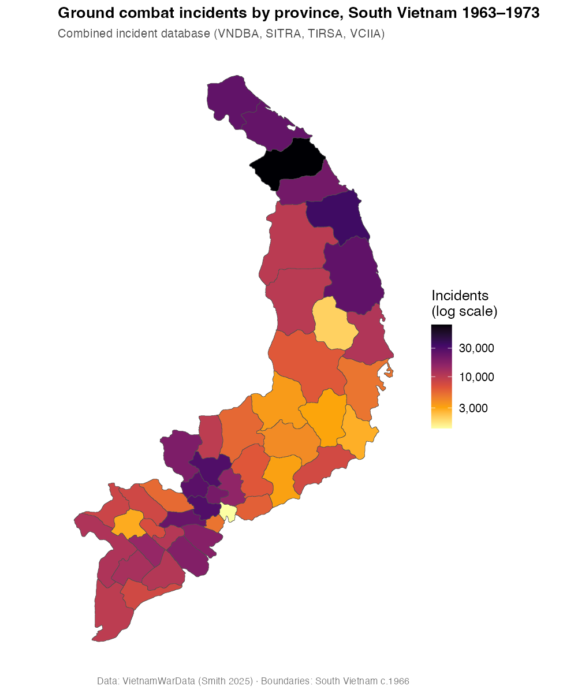

# Getting Started: A Province Choropleth Map

This article is a short, end-to-end walkthrough of the most common task
in `VietnamWarData`: pull a dataset, attach province boundaries, and map
it. The goal is to show the **workflow** — especially how the pieces
join together — not to produce a publication-quality figure. (For the
polished analyses, see Smith 2025.)

The code chunks below are not executed when the site is built, because
[`get_comb_inc_dta()`](https://gl-smith.github.io/VietnamWarData/reference/get_comb_inc_dta.md)
downloads a ~14 MB file from GitHub. Everything here runs as written on
your own machine; the map at the end is a pre-rendered copy of the
output.

## 1. Load the package

``` r

# install.packages("remotes")
# remotes::install_github("gl-smith/VietnamWarData")
library(VietnamWarData)
library(dplyr)
library(stringr)
library(sf)
library(ggplot2)
```

## 2. Get the province boundaries

[`get_province_boundaries()`](https://gl-smith.github.io/VietnamWarData/reference/get_province_boundaries.md)
returns an `sf` polygon layer of the 45 provinces of South Vietnam as
configured in 1966, together with their corps tactical zone. It ships
with the package, so there is no download — and, importantly, its
`prov_name` column uses the **same province names** as the data files.

``` r

provinces <- get_province_boundaries()
provinces
#> Simple feature collection with 45 features and 2 fields
#> Geometry type: MULTIPOLYGON ... CRS: WGS 84
#>   prov_name      corp                       geometry
#> 1  An Giang   IV Corp  MULTIPOLYGON (((105.0 10.5...
#> ...
```

## 3. Get the combined incident database

[`get_comb_inc_dta()`](https://gl-smith.github.io/VietnamWarData/reference/get_comb_inc_dta.md)
returns the master incident-level table that joins VNDBA, SITRA, TIRSA,
and VCIIA — 638,760 rows covering ground combat in South Vietnam,
1963–1973. The first call downloads and caches the file; later calls
read from the cache.

``` r

comb <- get_comb_inc_dta()
nrow(comb)
#> [1] 638760
```

## 4. Aggregate, then join on `prov_name`

Count incidents per province with
[`dplyr::count()`](https://dplyr.tidyverse.org/reference/count.html),
then
[`left_join()`](https://dplyr.tidyverse.org/reference/mutate-joins.html)
onto the boundary layer. Because both objects key on `prov_name`, the
join is exact — all 45 provinces match, with no leftovers on either
side.
([`st_drop_geometry()`](https://r-spatial.github.io/sf/reference/st_geometry.html)
turns the counting step into a plain data-frame operation; the geometry
comes back through the join.)

``` r

counts <- comb |>
  mutate(prov_name = str_squish(prov_name)) |>
  count(prov_name, name = "incidents")

map_df <- provinces |>
  left_join(counts, by = "prov_name")

# sanity check: every province matched
map_df |>
  st_drop_geometry() |>
  summarise(unmatched = sum(is.na(incidents)))
#>   unmatched
#> 1         0
```

This `prov_name` key is the same across the other province-coded
datasets (SEAFA, the HES files, PSYOPS), so the same recipe maps any of
them.

## 5. Draw the choropleth

``` r

ggplot(map_df) +
  geom_sf(aes(fill = incidents), color = "grey30", linewidth = 0.15) +
  scale_fill_viridis_c(
    option = "inferno", direction = -1, trans = "log10",
    labels = scales::comma, name = "Incidents\n(log scale)"
  ) +
  labs(
    title = "Ground combat incidents by province, South Vietnam 1963–1973",
    subtitle = "Combined incident database (VNDBA, SITRA, TIRSA, VCIIA)"
  ) +
  theme_minimal()
```

The result (pre-rendered):



## Where to go next

- Swap
  [`get_comb_inc_dta()`](https://gl-smith.github.io/VietnamWarData/reference/get_comb_inc_dta.md)
  for any other `get_*()` function to map a different source file.
- Summarize a different column —
  e.g. `group_by(prov_name) |> summarise(kia = sum(n_enemy_kia, na.rm = TRUE))`
  instead of
  [`count()`](https://dplyr.tidyverse.org/reference/count.html).
- Use the `corp` column from
  [`get_province_boundaries()`](https://gl-smith.github.io/VietnamWarData/reference/get_province_boundaries.md)
  to summarize by corps tactical zone instead of province.

See the [reference
index](https://gl-smith.github.io/VietnamWarData/reference/index.md) for
the full list of datasets, and Smith (2025) for the data construction
and the substantive analyses.
