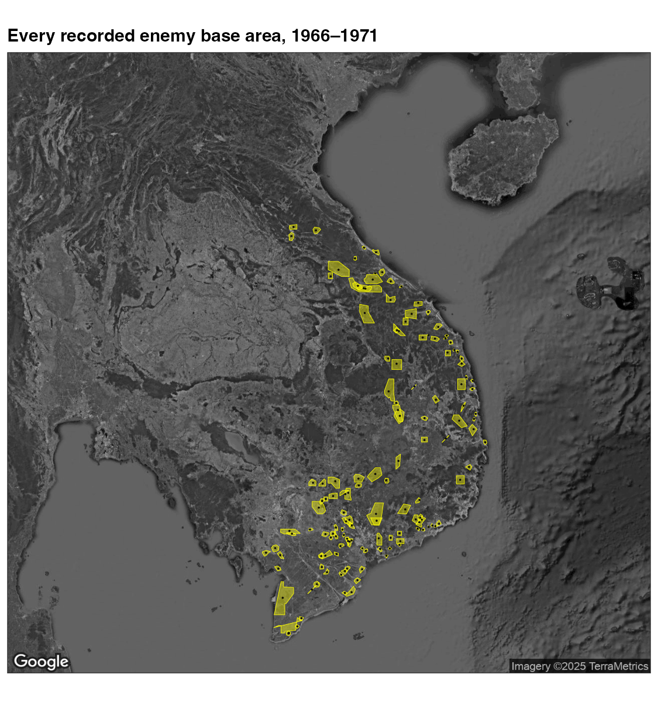
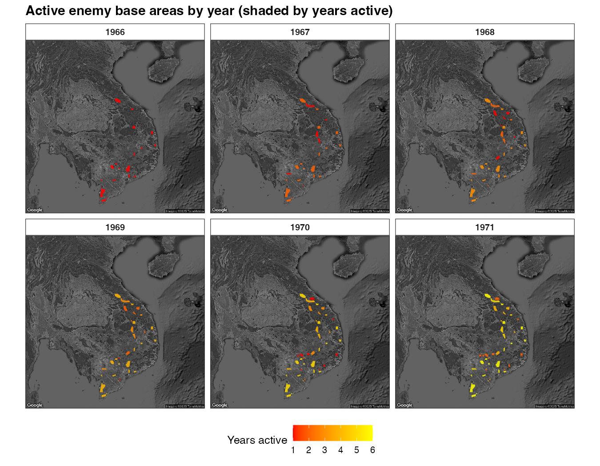

```{r, include = FALSE}
knitr::opts_chunk$set(collapse = TRUE, comment = "#>", eval = FALSE)
```

The Base Area Status File (`get_basfa()`) is the package's polygon dataset: it
records the boundaries and yearly status of 139 Viet Cong / NVA base areas in
South Vietnam, North Vietnam, and Cambodia (1966–1971). This article shows how
to turn it into `sf` polygons and map them over a satellite basemap.

The code chunks are not run at build time (they need the download); the figures
are pre-rendered.

> **Get a key, then cite `ggmap`.** The satellite basemap comes from the Google
> Maps Static API; this package does not redistribute Google's imagery, so
> `get_satellite_map()` fetches it with your own key (register it first via
> `ggmap::register_google()`). If you use it, cite Kahle, D. & Wickham, H.
> (2013), "ggmap: Spatial Visualization with ggplot2," *The R Journal*
> 5(1):144–161. Map imagery © Google.

## Setup

`get_basfa()` returns an `sf` object (POLYGON geometry), so it works with
`geom_sf()` straight away.

```{r}
library(VietnamWarData)
library(dplyr)
library(sf)
library(ggmap)
library(ggplot2)

# One-time: activate your Google Maps Platform API key
# register_google(key = "YOUR_GOOGLE_MAPS_API_KEY")

basfa <- get_basfa()
se_asia <- get_satellite_map("se_asia")
```

## Every recorded base area

Each base area appears once per month it was tracked, so reduce to one row per
`base_area_id` before mapping. Lay the polygons over the basemap with
`geom_sf(inherit.aes = FALSE)`, and add each area's centroid
(`center_long`, `center_lat`) as a point.

```{r}
distinct_bases <- basfa |>
  distinct(base_area_id, .keep_all = TRUE)

ggmap(se_asia) +
  geom_sf(
    data = distinct_bases,
    fill = "yellow1", color = "yellow1", alpha = 0.4, linewidth = 0.2,
    inherit.aes = FALSE
  ) +
  geom_point(
    data = distinct_bases,
    aes(center_long, center_lat),
    color = "black", size = 0.15, alpha = 0.8, inherit.aes = FALSE
  ) +
  labs(x = NULL, y = NULL)
```

```{r, eval = TRUE, echo = FALSE, out.width = "75%", fig.align = "center"}

```

## Active base areas, year by year

`current_status` flags whether an area was `"Active"` in a given year. Here we
keep the active areas, count how many years each has been active, and facet by
year — the fill shows cumulative years active.

```{r}
active_counts <- basfa |>
  st_drop_geometry() |>
  distinct(base_area_id, year, current_status) |>
  group_by(base_area_id) |>
  summarize(
    first_active_year = if (any(current_status == "Active")) min(year[current_status == "Active"]) else NA,
    last_active_year  = if (any(current_status == "Active")) max(year[current_status == "Active"]) else NA,
    any_active = any(current_status == "Active"),
    .groups = "drop"
  ) |>
  filter(any_active) |>
  tidyr::pivot_longer(c(first_active_year, last_active_year), values_to = "year") |>
  group_by(base_area_id) |>
  tidyr::complete(year = min(year):max(year)) |>
  mutate(years_active = cumsum(rep(1, n()))) |>
  ungroup() |>
  select(base_area_id, year, years_active)

active_sf <- basfa |>
  filter(current_status == "Active") |>
  distinct(base_area_id, year, .keep_all = TRUE) |>
  inner_join(active_counts, by = c("base_area_id", "year"))

ggmap(se_asia) +
  geom_sf(data = active_sf, aes(fill = years_active), color = NA,
          alpha = 0.85, inherit.aes = FALSE) +
  facet_wrap(~ year, nrow = 2) +
  scale_fill_gradientn(colors = c("red", "orange", "yellow"), na.value = "grey50") +
  labs(fill = "Years active", x = NULL, y = NULL)
```

```{r, eval = TRUE, echo = FALSE, out.width = "100%", fig.align = "center"}

```

## Notes

- The polygons carry no CRS (coordinates are plain longitude/latitude), which is
  why they align directly with the `ggmap` basemap.
- `get_basfa()` also includes `province`, `vc_military_region`, and priority
  fields you can map or facet on.
- For incident (point) mapping over satellite imagery, see the
  [satellite article](satellite-maps.html).
