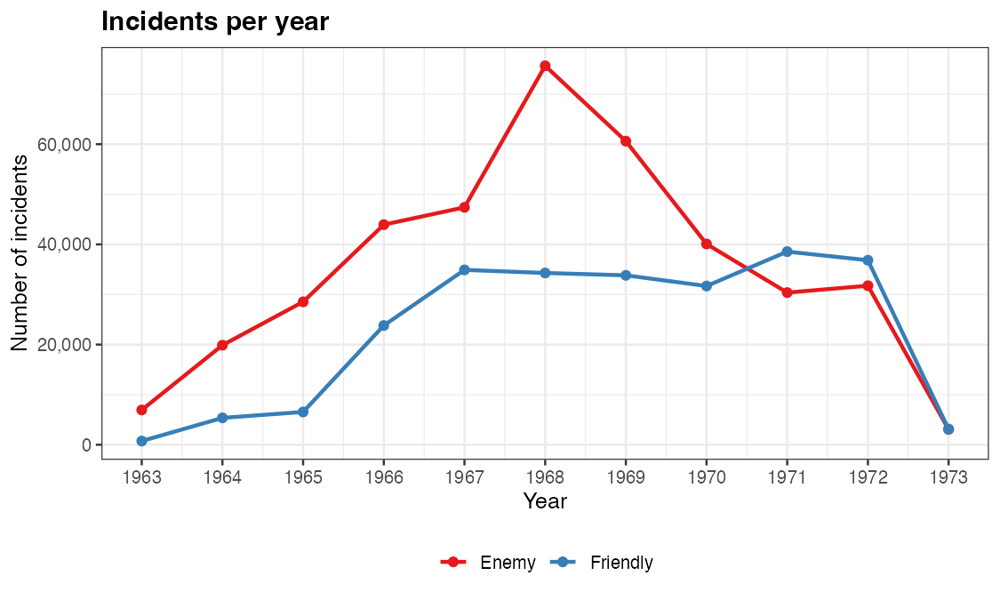
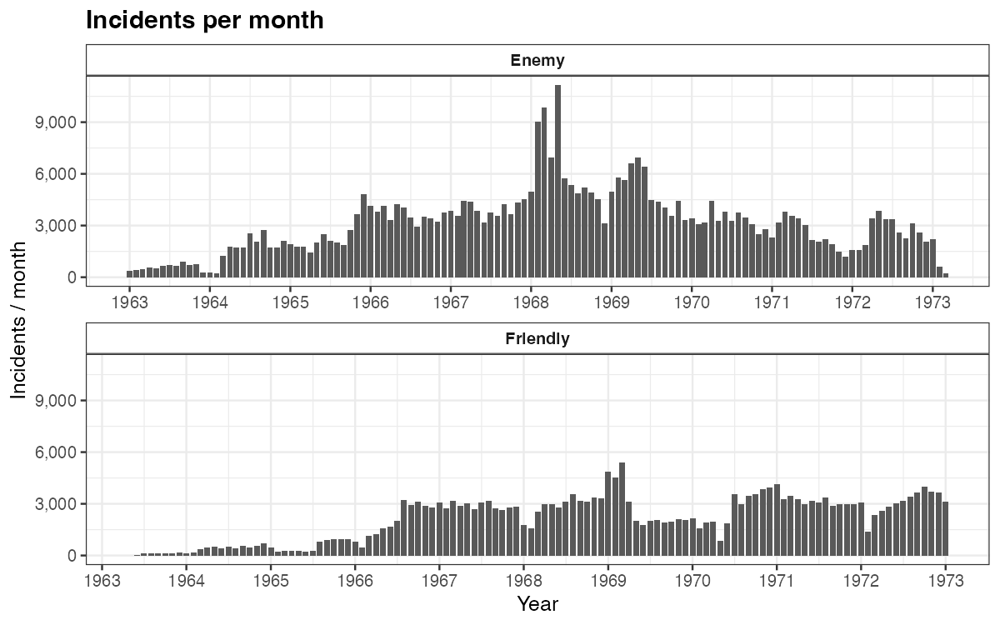
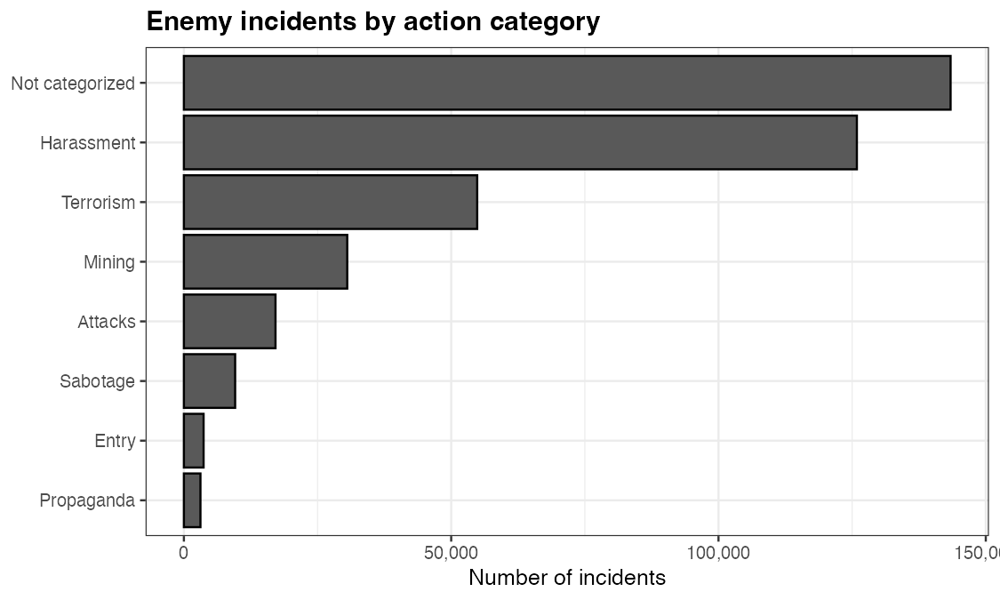

```{r, include = FALSE}
knitr::opts_chunk$set(collapse = TRUE, comment = "#>", eval = FALSE)
```

This article covers the other workhorse task with the combined data: **counting
incidents** — over time (annual and monthly time series) and by category. As
elsewhere, the code is shown but not executed at build time; the figures are
pre-rendered.

## Setup

```{r}
library(VietnamWarData)
library(dplyr)
library(lubridate)
library(ggplot2)
library(scales)

incidents <- get_comb_inc_dta()
```

## Incidents per year

Count by `initiation_date` year and `aggressor_side`. The 1968 Tet Offensive
stands out as the peak of enemy-initiated activity.

```{r}
incidents |>
  filter(!is.na(aggressor_side), between(year(initiation_date), 1963, 1973)) |>
  mutate(year = year(initiation_date)) |>
  count(year, aggressor_side) |>
  ggplot(aes(year, n, color = aggressor_side)) +
  geom_line(linewidth = 1) +
  geom_point(size = 2) +
  scale_x_continuous(breaks = 1963:1973) +
  scale_y_continuous(labels = comma) +
  scale_color_brewer(palette = "Set1") +
  labs(x = "Year", y = "Number of incidents", color = NULL)
```

```{r, eval = TRUE, echo = FALSE, out.width = "85%", fig.align = "center"}

```

## Incidents per month

`lubridate::floor_date()` collapses dates to the first of each month for a finer
time series, faceted by side.

```{r}
incidents |>
  filter(!is.na(aggressor_side), between(year(initiation_date), 1963, 1973)) |>
  mutate(ym = floor_date(initiation_date, "month")) |>
  count(ym, aggressor_side) |>
  ggplot(aes(ym, n)) +
  geom_col(fill = "grey35") +
  facet_wrap(~ aggressor_side, ncol = 1, scales = "free_x") +
  scale_x_date(date_breaks = "1 year", date_labels = "%Y") +
  scale_y_continuous(labels = comma) +
  labs(x = "Year", y = "Incidents / month")
```

```{r, eval = TRUE, echo = FALSE, out.width = "90%", fig.align = "center"}

```

## Incident counts by category

A simple `count()` ranks enemy-initiated incidents by `enemy_action_category`.
`reorder()` sorts the bars; `coord_flip()` makes the labels readable.

```{r}
incidents |>
  filter(aggressor_side == "Enemy", between(year(initiation_date), 1963, 1973)) |>
  mutate(
    enemy_action_category = coalesce(enemy_action_category, "Not categorized"),
    # tidy up a spelling artifact carried over from the source file
    enemy_action_category = recode(enemy_action_category, "Sabotoge" = "Sabotage")
  ) |>
  count(enemy_action_category) |>
  mutate(enemy_action_category = reorder(enemy_action_category, n)) |>
  ggplot(aes(enemy_action_category, n)) +
  geom_col(fill = "grey35", color = "black") +
  coord_flip() +
  scale_y_continuous(labels = comma) +
  labs(x = NULL, y = "Number of incidents")
```

```{r, eval = TRUE, echo = FALSE, out.width = "85%", fig.align = "center"}

```

## Where to go next

- Swap `aggressor_side` for `data_file_origin` to see how each source file
  contributes over time.
- Count a different column (e.g. `general_action_category`, `prov_name`) the
  same way.
- Map these counts spatially with the
  [province choropleth](province-map.html) or
  [satellite](satellite-maps.html) articles.
