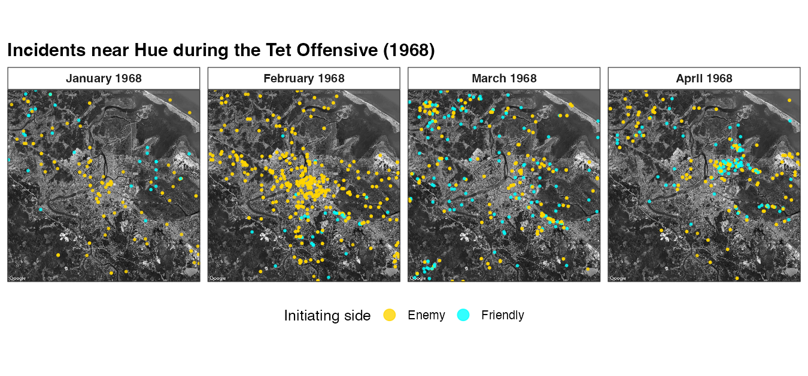
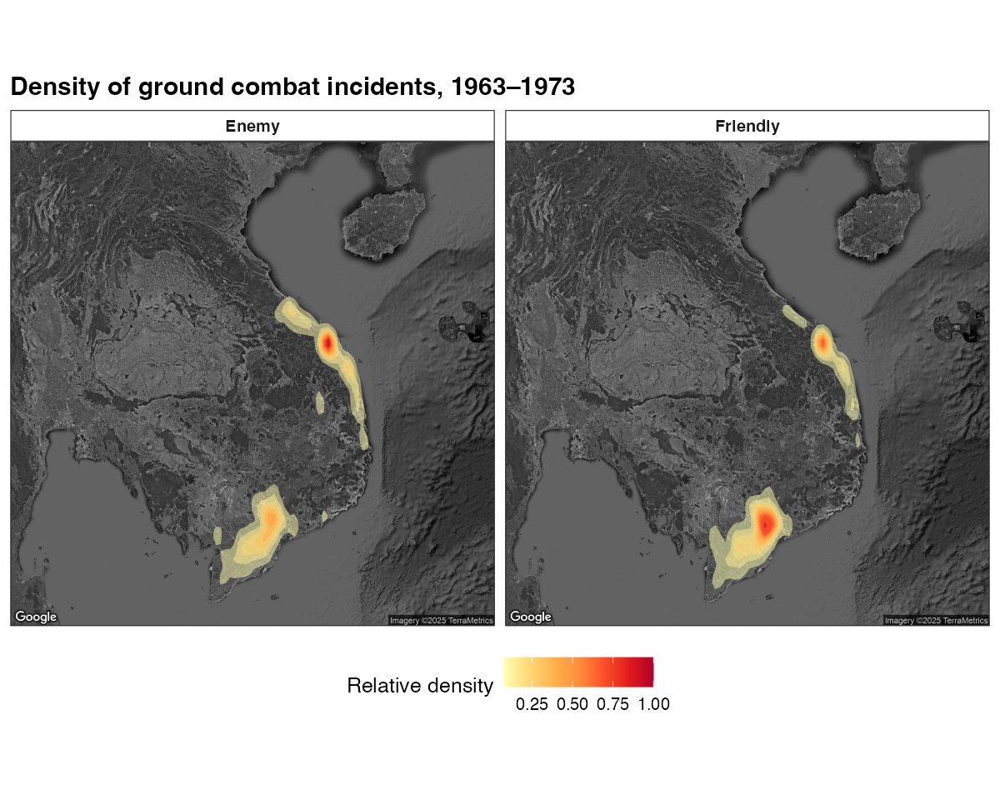

```{r, include = FALSE}
knitr::opts_chunk$set(collapse = TRUE, comment = "#>", eval = FALSE)
```

This article maps the combined incident data on top of Google satellite
basemaps — first as **point maps** of individual incident coordinates, then as
an **aggregate heat map** of incident density.

The basemaps come from the **Google Maps Static API**. Google's terms don't
permit redistributing their imagery, so this package does **not** ship the
basemaps — instead, `get_satellite_map()` fetches them at call time using your
own (free) Google Maps API key. The chunks are not run at build time; the
figures shown are pre-rendered static exports (© Google).

> **Get a key, then cite `ggmap`.** Register a Google Maps Platform API key and
> activate it with `ggmap::register_google(key = "...")` before calling
> `get_satellite_map()`. If you use these basemaps, cite Kahle, D. & Wickham, H.
> (2013), "ggmap: Spatial Visualization with ggplot2," *The R Journal*
> 5(1):144–161. Map imagery © Google.

## Setup

```{r}
library(VietnamWarData)
library(dplyr)
library(ggmap)
library(ggplot2)

# One-time: activate your Google Maps Platform API key
# register_google(key = "YOUR_GOOGLE_MAPS_API_KEY")

incidents <- get_comb_inc_dta()
```

## A point map: incidents near Hue during the Tet Offensive

Fetch a satellite basemap centered on Hue with `get_satellite_map("hue")`. Lay
incident coordinates over it with `geom_point()` (use `inherit.aes = FALSE` so
the points don't inherit the basemap's aesthetics), and facet by month to watch
the January 1968 Tet Offensive unfold.

```{r}
hue_map <- get_satellite_map("hue")
bb <- attr(hue_map, "bb")   # basemap bounding box

hue_pts <- incidents |>
  filter(
    !is.na(lat), !is.na(lng), !is.na(aggressor_side),
    between(lng, bb$ll.lon, bb$ur.lon),
    between(lat, bb$ll.lat, bb$ur.lat),
    between(initiation_date, as.Date("1968-01-01"), as.Date("1968-04-30"))
  ) |>
  mutate(month = factor(
    format(initiation_date, "%B 1968"),
    levels = format(seq(as.Date("1968-01-01"), as.Date("1968-04-01"), "month"), "%B 1968")
  ))

ggmap(hue_map) +
  geom_point(
    data = hue_pts,
    aes(lng, lat, color = aggressor_side),
    size = 0.6, alpha = 0.8, inherit.aes = FALSE
  ) +
  scale_color_manual(values = c("Enemy" = "#FFD400", "Friendly" = "#00FFFF")) +
  facet_wrap(~ month, nrow = 1) +
  labs(x = NULL, y = NULL, color = "Initiating side")
```

```{r, eval = TRUE, echo = FALSE, out.width = "100%", fig.align = "center"}

```

## A heat map: incident density across Southeast Asia

For an aggregate view, drop the points and use `stat_density2d()` over a
Southeast Asia basemap. Faceting by `aggressor_side` contrasts where enemy- and
friendly-initiated incidents concentrated.

```{r}
se_asia_map <- get_satellite_map("se_asia")

sea <- incidents |>
  filter(
    !is.na(lat), !is.na(lng),
    aggressor_side %in% c("Friendly", "Enemy"),
    between(lng, 100, 112), between(lat, 4.5, 25)
  )

ggmap(se_asia_map) +
  stat_density2d(
    data = sea,
    aes(lng, lat, fill = after_stat(nlevel)),
    geom = "polygon", alpha = 0.5, inherit.aes = FALSE
  ) +
  facet_wrap(~ aggressor_side) +
  scale_fill_distiller(palette = "YlOrRd", direction = 1) +
  labs(x = NULL, y = NULL, fill = "Relative density")
```

```{r, eval = TRUE, echo = FALSE, out.width = "90%", fig.align = "center"}

```

## Notes

- `get_satellite_map()` also provides a `"saigon"` basemap; for any other area,
  call `ggmap::get_map()` directly with your own bounding box.
- For a province-level static map without satellite imagery, see the
  [province choropleth article](province-map.html).
- The published, operation-length–weighted versions of these figures appear in
  Smith (2025).
