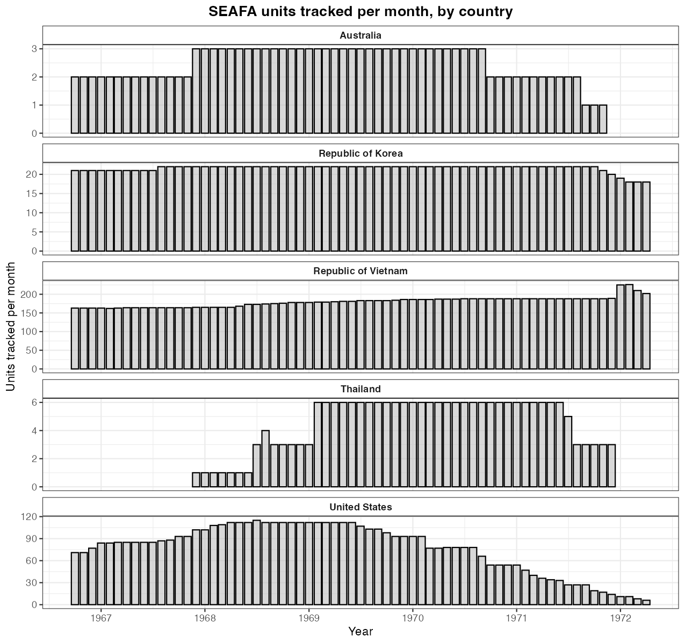
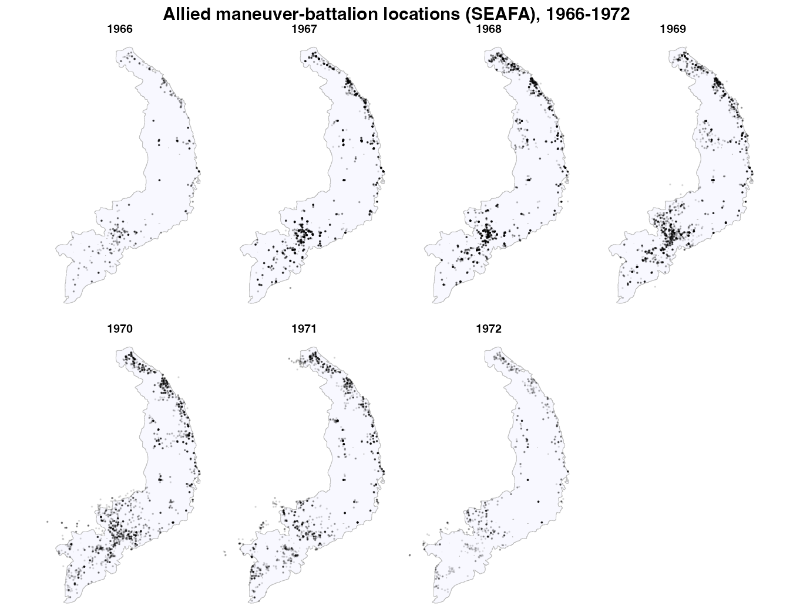
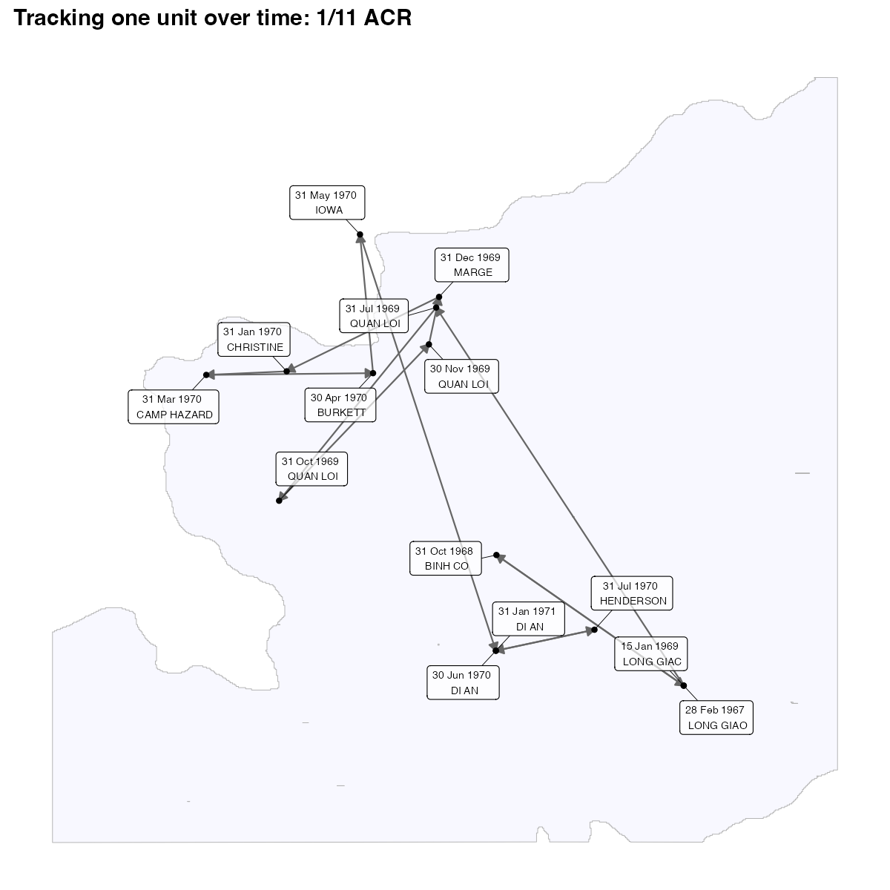

```{r, include = FALSE}
knitr::opts_chunk$set(collapse = TRUE, comment = "#>", eval = FALSE)
```

The Southeast Asia Forces Activity file (`get_seafa()`) records the monthly
location of American, South Vietnamese, and Allied maneuver battalions, 1966–1972.
This article counts the units tracked over time, maps every battalion location by
year, and follows a single unit's movements — adapting the data-paper's SEAFA
overview scripts.

One detail: SEAFA's `lat`/`lng` arrive as character, so coerce them to numeric
first. Code chunks are not run at build time; the figures are pre-rendered.

## Setup

```{r}
library(VietnamWarData)
library(dplyr)
library(lubridate)
library(sf)
library(ggplot2)
library(ggrepel)

seafa <- get_seafa() |>
  mutate(lat = as.numeric(lat), lng = as.numeric(lng),
         record_date = as.Date(record_date))

sv_outline <- get_province_boundaries() |> st_union()
```

## How many units were tracked each month?

```{r}
seafa |>
  filter(!is.na(record_date)) |>
  mutate(month = floor_date(record_date, "month")) |>
  count(month, country) |>
  ggplot(aes(month, n)) +
  geom_col(color = "black", fill = "gray", alpha = 0.6) +
  facet_wrap(vars(country), scales = "free_y", ncol = 1) +
  scale_x_date(date_breaks = "1 year", date_labels = "%Y") +
  scale_y_continuous(labels = scales::comma) +
  labs(x = "Year", y = "Units tracked per month")
```

```{r, eval = TRUE, echo = FALSE, out.width = "85%", fig.align = "center"}

```

## Every battalion location, by year

Drop records without coordinates, then plot each location over the South Vietnam
outline, faceted by year.

```{r}
seafa |>
  filter(!is.na(record_date), !is.na(lat)) |>
  mutate(year = year(record_date)) |>
  ggplot() +
  geom_sf(data = sv_outline, fill = "ghostwhite", color = "grey75") +
  geom_point(aes(lng, lat), color = "black", alpha = 0.1, size = 1/10) +
  facet_wrap(~ year, nrow = 2) +
  labs(x = NULL, y = NULL) +
  theme_void()
```

```{r, eval = TRUE, echo = FALSE, out.width = "100%", fig.align = "center"}

```

## Track one unit over time

Because each unit is reported monthly, you can follow a battalion's movements.
Filter to a unit (here the 11th Armored Cavalry's 1/11 ACR), drop months where it
didn't move, and draw arrows between successive positions with date/station labels.

```{r}
unit_move <- seafa |>
  filter(unit_name == "1/11 ACR", country == "United States", !is.na(lat)) |>
  arrange(record_date) |>
  filter(lat != lag(lat) & lng != lag(lng)) |>
  mutate(next_lng = lead(lng), next_lat = lead(lat))

ggplot() +
  geom_sf(data = sv_outline, fill = "ghostwhite", color = "grey70") +
  geom_segment(
    data = filter(unit_move, !is.na(next_lng)),
    aes(x = lng, y = lat, xend = next_lng, yend = next_lat),
    linewidth = 0.5, color = "grey40",
    arrow = arrow(length = unit(0.2, "cm"), type = "closed", ends = "last")
  ) +
  geom_point(data = unit_move, aes(lng, lat), color = "black", size = 1.2) +
  geom_label_repel(
    data = unit_move,
    aes(lng, lat, label = paste(format(record_date, "%d %b %Y"), "\n", station)),
    size = 2.4, box.padding = 0.6, fill = alpha("white", 0.7), max.overlaps = 20
  ) +
  coord_sf(xlim = range(unit_move$lng) + c(-0.4, 0.4),
           ylim = range(unit_move$lat) + c(-0.4, 0.4)) +
  labs(x = NULL, y = NULL) +
  theme_minimal()
```

```{r, eval = TRUE, echo = FALSE, out.width = "85%", fig.align = "center"}

```

> The data-paper version of this figure draws the track over a Google satellite
> basemap. To do that, replace the `geom_sf()` outline with
> `ggmap::ggmap(get_satellite_map("saigon"))` (after `ggmap::register_google()`
> with your own key) — see the
> [satellite article](satellite-maps.html). The package ships no Google imagery,
> so this version uses the province outline instead.

## Notes

- `get_seafa()` also has `service` (Army/Marine), `unit_type`, `station`, and
  `control_hq_unit_name` for counting or faceting.
- Use `count(unit_name, sort = TRUE)` to find the most frequently tracked units.
